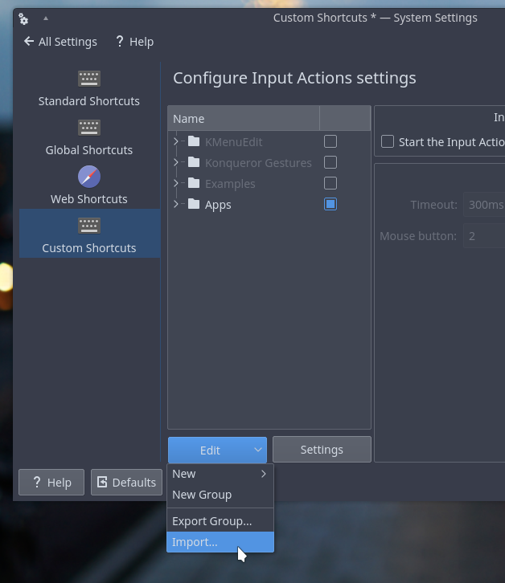

# Unmaintained ⚠️

This project was rewritten to Python: [prtscr-ultimate](https://github.com/MikeWent/prtscr-ultimate)

# screenshot-sh

This is a solutions to my main problem with KDE: spectate can not copy screensot to clipboard via hotkey. So I decided to use **scrot** + **xclip**

## How to use

```sh
# 1. Install necessary software
sudo apt install scrot xclip

# 2. Download screenshot-sh
cd ~/.local/share
git clone git@github.com:MikeWent/screenshot-sh.git
cd screenshot-sh

# 3. Generate .khotkeys
./screenshot.sh --gen

# 4. Import screenshot-sh.khotkeys (see pic below)
systemsettings5 &
```



## License

WTFPL
